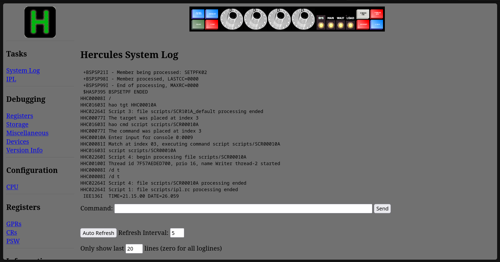
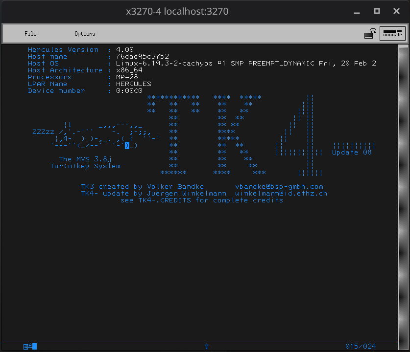
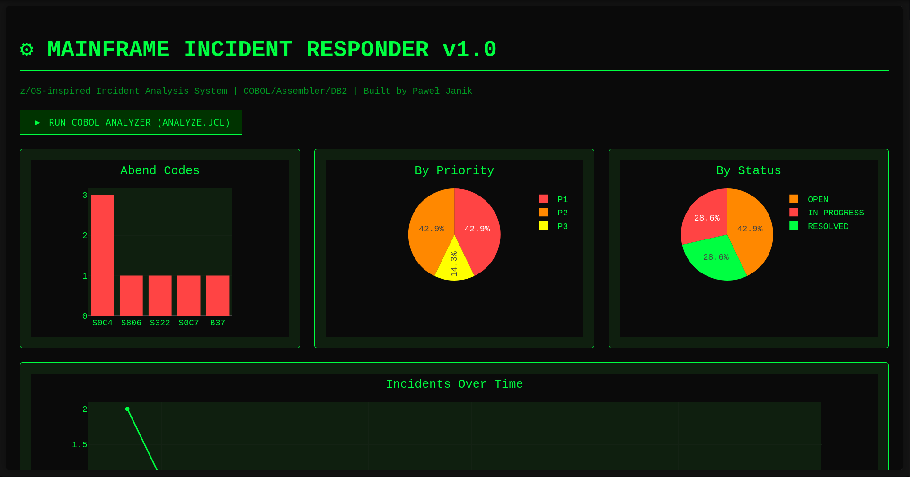
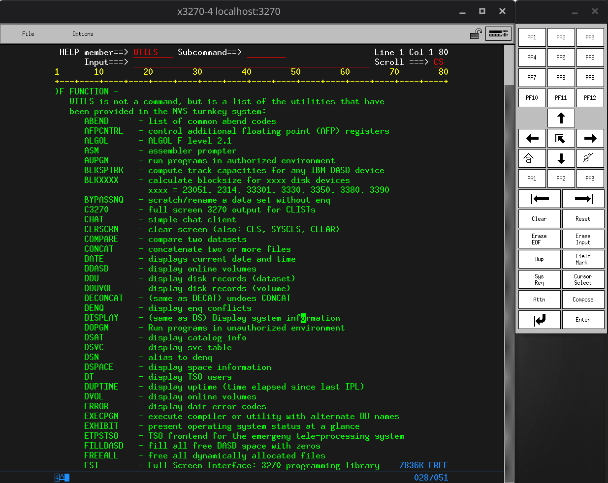

# Mainframe Incident Responder

> z/OS-inspired incident analysis system built with COBOL, Assembler, DB2/SQLite and Python. Demonstrates mainframe development fundamentals: batch processing, abend analysis, memory diagnostics and legacy system modernization via a web dashboard.
## Technology Stack

| Layer                 | Technology                     | Role                                       |
| --------------------- | ------------------------------ | ------------------------------------------ |
| Batch processing      | GnuCOBOL 3.x                   | Incident classification, report generation |
| Low-level diagnostics | NASM Assembler                 | Memory validation, S0C4/overflow detection |
| Database              | SQLite (DB2-compatible schema) | Incident storage                           |
| Scripting & API       | Python 3 + Flask + Plotly      | Dashboard, REST endpoint, abend runner     |
| Job Control           | JCL (ANALYZE.JCL)              | z/OS-style batch job orchestration         |
| Emulator              | Hercules + MVS TK4             | z/OS environment simulation                |

## Architecture

```
┌──────────────────────────────────────────────────────────────────────┐
│                        z/OS (Hercules / MVS 3.8j)                    │
│                                                                      │
│   ┌──────────────┐    JCL     ┌─────────────────────────────────┐   │
│   │  ANALYZE.JCL │──────────▶│     INCIDENT-ANALYZER.CBL        │   │
│   │ (Job Control │           │     (COBOL batch program)        │   │
│   │  Language)   │           │                                  │   │
│   └──────────────┘           │  ┌──────────┐  ┌─────────────┐  │   │
│                              │  │   DB2 /  │  │   MEMDIAG   │  │   │
│                              │  │  SQLite  │  │    (.asm)   │  │   │
│                              │  │ incidents│  │  Assembler  │  │   │
│                              │  └────┬─────┘  └──────┬──────┘  │   │
│                              └───────┼────────────────┼─────────┘   │
│                                      │                │             │
│                              ┌───────▼────────────────▼──────────┐  │
│                              │         report.txt / output.json  │  │
│                              └───────────────────┬───────────────┘  │
└──────────────────────────────────────────────────┼──────────────────┘
                                                   │
                                    ┌──────────────▼──────────────┐
                                    │    Python (memdiag-runner)  │
                                    │    + Flask app (app.py)     │
                                    │    + Plotly dashboard       │
                                    └──────────────┬──────────────┘
                                                   │
                                    ┌──────────────▼──────────────┐
                                    │   Web Dashboard             │
                                    │   http://localhost:5000     │
                                    └─────────────────────────────┘
```



## Quick Start

```zsh
# 1. Start the Hercules emulator
cd hercules && ./start-hercules.sh

# 2. Compile and run the COBOL batch job
cobc -x INCIDENT-ANALYZER.cbl -o incident-analyzer && ./incident-analyzer

# 3. Launch the Python web dashboard (after creating venv and activating it)
pip install -r requirements.txt && python app.py
```

## COBOL Batch Processing

The core program `INCIDENT-ANALYZER.cbl` reads incident records from the SQLite database,
classifies each record by abend type (S0C4, S0C7, S322, B37, S806), assigns severity,
and writes a formatted text report to `output/report.txt`.

Job execution is orchestrated via `ANALYZE.JCL` — a standard z/OS Job Control Language file
that mirrors how real mainframe batch jobs are submitted.

## Assembler Memory Diagnostics

`MEMDIAG.asm` is a NASM Assembler module called by the Python runner (`memdiag-runner.py`). It simulates low-level memory boundary checks analogous to S0C4 (protection exception)
and stack overflow detection found on real IBM mainframe hardware. Results are passed back to Python via return codes and parsed into the incident database.

## Web Dashboard


The Flask application (`app.py`) serves an interactive Plotly dashboard at `http://localhost:5000`. It reads `output/report.json` generated by the COBOL job and renders:
- **Abend distribution** – pie/bar chart of incident types
- **Severity timeline** – incidents over time by priority
- **Top abend codes** – ranked list with descriptions

A REST endpoint `/api/incidents` returns raw JSON for integration with external tools.

## Project Structure

```
mainframe-incident-responder/
├── INCIDENT-ANALYZER.cbl   # COBOL batch program
├── ANALYZE.JCL             # z/OS Job Control Language
├── MEMDIAG.asm             # NASM Assembler diagnostics module
├── memdiag-runner.py       # Python wrapper for Assembler module
├── app.py                  # Flask web dashboard
├── db2-schema.sql          # DB2-compatible SQLite schema
├── requirements.txt        # Python dependencies
├── hercules/               # Hercules emulator config & startup scripts
├── output/                 # Generated reports (report.txt, report.json)
├── screenshots/            # Project screenshots (see below)
└── docs/
    └── incident-playbook.md  # z/OS abend analysis playbook
```

